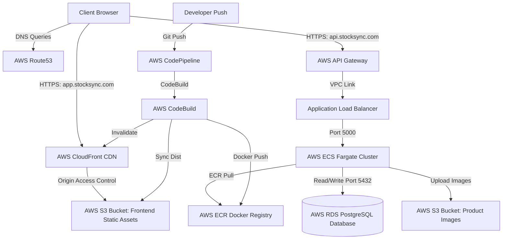

# AWS Cloud Production Deployment Guide: StockSync

This document details the step-by-step instructions to deploy the **StockSync** application on AWS in a highly available, secure, and production-ready architecture.

---

## Architecture Overview

---

## Step 1: Database Setup (AWS RDS PostgreSQL)

1. Open the **Amazon RDS Console**.
2. Click **Create database** and select the following:
   - **Database creation method**: Easy Create or Standard Create (Standard recommended).
   - **Engine type**: PostgreSQL.
   - **Engine Version**: PostgreSQL 16.x.
   - **Templates**: Dev/Test or Production (based on your budget).
3. **Settings**:
   - **DB instance identifier**: `stocksync-production-db`
   - **Master username**: `stocksync_admin`
   - **Master password**: *[Generate a secure password]*
4. **Connectivity**:
   - **Virtual private cloud (VPC)**: Select your Default VPC (or create a custom one with private/public subnets).
   - **Public access**: **No** (highly secure; ECS tasks will communicate via VPC security groups).
   - **VPC security group**: Create a new security group named `stocksync-rds-sg`.
5. **Database options**:
   - **Initial database name**: `stocksync_db`
6. Click **Create database**.
7. Once created, note the **Endpoint** (under Connectivity & security).
8. Go to the EC2 console under **Security Groups**, select `stocksync-rds-sg`, and add an **Inbound Rule**:
   - **Type**: PostgreSQL (Port 5432)
   - **Source**: Custom -> select the Security Group that will be assigned to ECS tasks (`stocksync-ecs-sg`).

---

## Step 2: Frontend Hosting & CDN (S3 + CloudFront + Route53)

### 1. Create S3 Bucket for Frontend Hosting
1. Open the **Amazon S3 Console**.
2. Click **Create bucket**:
   - **Bucket name**: `stocksync-frontend-dist-bucket` (names must be unique globally).
   - **AWS Region**: Select your region (e.g., `us-east-1`).
   - **Block Public Access settings**: Keep **Block all public access** checked (highly recommended; CloudFront will access via OAC).
3. Click **Create bucket**.

### 2. Create S3 Bucket for Product Images
1. Click **Create bucket**:
   - **Bucket name**: `stocksync-product-images-production`
   - **Block Public Access settings**: Uncheck **Block all public access** (since images are accessed directly by users, or keep blocked and serve through CloudFront as a separate behavior path).
2. Click **Create bucket**.

### 3. Create CloudFront CDN Distribution
1. Open the **CloudFront Console**.
2. Click **Create distribution**:
   - **Origin domain**: Select your S3 bucket `stocksync-frontend-dist-bucket.s3.amazonaws.com`.
   - **Origin access**: Select **Origin access control settings (recommended)**.
     - Click **Create control setting**, use default settings, and click **Create**.
   - **Viewer protocol policy**: Select **Redirect HTTP to HTTPS**.
   - **Allowed HTTP methods**: Select `GET, HEAD`.
   - **Default root object**: Set to `index.html`.
   - **Custom Error Responses** (Critical for Single Page Apps with React Router):
     - Go to the **Error pages** tab and click **Create custom error response**.
     - **HTTP error code**: `403: Forbidden`
     - **Customize error response**: Yes
     - **Response page path**: `/index.html`
     - **HTTP Response code**: `200: OK`
     - Repeat the same custom error configuration for `404: Not Found`.
3. Click **Create distribution**.
4. Once the distribution is deployed, copy the **Policy statement** shown in yellow, open the S3 console for your frontend bucket, go to the **Permissions** tab, select **Bucket Policy**, and paste the statement (this allows CloudFront to read assets from your private bucket).

---

## Step 3: Container Registry (Amazon ECR)

1. Open the **Amazon ECR Console**.
2. Click **Create repository**:
   - **Visibility settings**: Private.
   - **Repository name**: `stocksync-backend`.
3. Click **Create repository**.
4. Note down the **URI** (e.g., `123456789012.dkr.ecr.us-east-1.amazonaws.com/stocksync-backend`).

---

## Step 4: Container Orchestration (ECS Fargate)

### 1. Create ECS Task Execution Role
Ensure your account has an IAM execution role (`ecsTaskExecutionRole`) containing `AmazonECSTaskExecutionRolePolicy` and permissions to read secrets from AWS Systems Manager Parameter Store or Secrets Manager.

### 2. Create ECS Task Definition
1. Open the **Amazon ECS Console**.
2. In the left navigation, select **Task Definitions** and click **Create new task definition (Fargate)**:
   - **Task definition family**: `stocksync-backend-td`.
   - **Operating system/Architecture**: Linux/ARM64 or X86_64.
   - **Task size**: CPU: `.0.5 vCPU`, Memory: `1 GB`.
   - **Task execution role**: `ecsTaskExecutionRole`.
3. **Container - 1**:
   - **Name**: `stocksync-backend`.
   - **Image URI**: Enter your ECR repository URI with `:latest` tag.
   - **Port mappings**: Container port `5000`, Protocol `TCP`, App protocol `HTTP`.
   - **Environment variables**: Add keys:
     - `PORT`: `5000`
     - `NODE_ENV`: `production`
     - `DB_HOST`: *[Your RDS Endpoint]*
     - `DB_PORT`: `5432`
     - `DB_NAME`: `stocksync_db`
     - `DB_USER`: `stocksync_admin`
     - `DB_PASS`: *[Your RDS Password]*
     - `DB_SSL`: `true`
     - `JWT_SECRET`: *[Generate a 32-character secure secret string]*
     - `AWS_ACCESS_KEY_ID`, `AWS_SECRET_ACCESS_KEY`, `AWS_REGION`, `AWS_S3_BUCKET_NAME` for the product images bucket.
4. Click **Create**.

### 3. Create ECS Cluster & Fargate Service
1. In the ECS Console, click **Clusters** -> **Create cluster**:
   - **Cluster name**: `stocksync-production-cluster`.
   - **Infrastructure**: AWS Fargate (serverless).
2. Click **Create**.
3. Select your new cluster, go to the **Services** tab, and click **Create**:
   - **Compute configuration**: Capacity provider strategy (Fargate).
   - **Deployment configuration**: Service.
   - **Task Family**: Select `stocksync-backend-td`.
   - **Service name**: `stocksync-backend-service`.
   - **Desired tasks**: `1` or `2`.
   - **Networking**:
     - Select your VPC and Private Subnets (recommended) or Public Subnets.
     - **Security group**: Create a new security group named `stocksync-ecs-sg`. Allow Inbound traffic on port **5000** (from the Load Balancer security group).
     - **Load Balancing**: Select **Application Load Balancer (ALB)**.
       - Create a new Load Balancer named `stocksync-alb`.
       - Target group name: `stocksync-backend-tg` (Health check path: `/health`).
4. Click **Create**.

---

## Step 5: Network Gateway (API Gateway)

To route client requests from the internet to your private ALB:
1. Open the **Amazon API Gateway Console**.
2. Click **Create API** and select **HTTP API**:
   - **API Name**: `stocksync-api-gateway`.
3. Click **Next**.
4. Configure Routes:
   - Create route `ANY /{proxy+}`.
   - Integration: **VPC Link** -> Link to your ALB. Set Target URL to `http://[Your ALB DNS Name]/{proxy}`.
5. Deploy the API and note the generated **Invoke URL** (e.g., `https://abcdefg.execute-api.us-east-1.amazonaws.com`). This URL is your `VITE_API_URL`.

---

## Step 6: Domain Setup (Route 53)

1. Open the **Route 53 Console**.
2. Go to **Hosted zones** and click on your domain name (e.g., `stocksync.com`).
3. Click **Create record**:
   - **Record name**: `app.stocksync.com`
   - **Record type**: A – Routes traffic to an IPv4 address.
   - **Alias**: Toggle to **Yes**.
   - **Route traffic to**: Alias to CloudFront distribution -> Select your CloudFront distribution domain.
4. Click **Create record**.
5. Create another record for the API:
   - **Record name**: `api.stocksync.com`
   - **Record type**: A.
   - **Alias**: Toggle to **Yes**.
   - **Route traffic to**: Alias to API Gateway -> Select regional API Gateway endpoint.
6. Click **Create record**.

---

## Step 7: Continuous Deployment Pipeline (AWS CodePipeline)

1. Open the **AWS CodePipeline Console**.
2. Click **Create pipeline**:
   - **Pipeline name**: `stocksync-pipeline`.
3. **Source Stage**:
   - **Source provider**: GitHub (Version 2).
   - **Connection**: Connect your GitHub account, select your project repository, and choose branch (e.g., `main`).
4. **Build Stage**:
   - **Build provider**: AWS CodeBuild.
   - **Project name**: Click **Create project**:
     - Project name: `stocksync-build-project`.
     - Environment image: Managed image -> Ubuntu -> Standard -> Runtime: Standard:7.0.
     - Enable **Privileged** flag (Required to build Docker images).
     - Buildspec: Select **Use a buildspec file** (CodeBuild will automatically read `buildspec.yml` in the project root).
     - Add environment variables:
       - `AWS_ACCOUNT_ID`: *[Your AWS Account ID]*
       - `AWS_DEFAULT_REGION`: `us-east-1`
       - `IMAGE_REPO_NAME`: `stocksync-backend`
       - `FRONTEND_S3_BUCKET`: `stocksync-frontend-dist-bucket`
       - `CLOUDFRONT_DIST_ID`: *[Your CloudFront Distribution ID]*
       - `VITE_API_URL`: `https://api.stocksync.com/api` (or your API Gateway Invoke URL).
5. **Deploy Stage**:
   - **Deploy provider**: Amazon ECS.
   - **Cluster name**: `stocksync-production-cluster`.
   - **Service name**: `stocksync-backend-service`.
   - **Input artifacts**: Select the output of the Build stage.
6. Click **Create pipeline**. CodePipeline will now automatically build, push ECR, update ECS, and synchronize the frontend S3 bucket on every commit to your Git repo.
